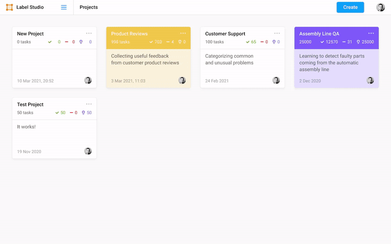

# Label Studio CI/CD pipeline

Deploy Label Studio server with CI/CD on Elestio

 
 

# Once deployed ...

You can open Label Studio ADMIN UI here:

    URL: https://[CI_CD_DOMAIN]
    email: admin
    password: [ADMIN_PASSWORD]

You can open pgAdmin here:

    URL: https://[CI_CD_DOMAIN]:30797
    email: [ADMIN_EMAIL]
    password: [ADMIN_PASSWORD]
